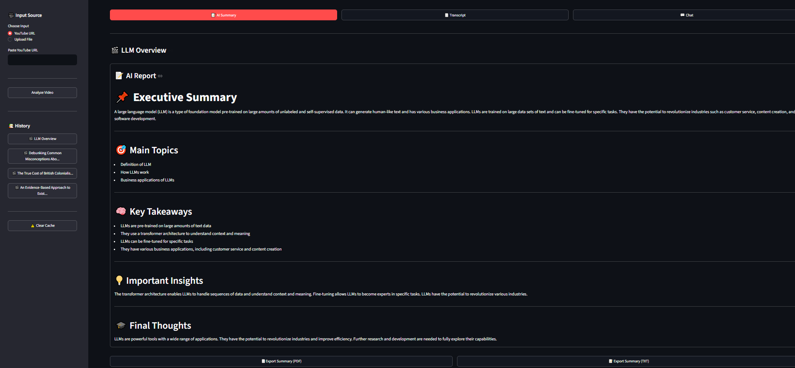

# 🎬 VideoMind AI – Intelligent Video Analysis & RAG Assistant

<p align="center">

Transform **YouTube videos, meetings, lectures, podcasts, and uploaded media** into **searchable knowledge** using **Speech Recognition, Large Language Models (LLMs), and Retrieval-Augmented Generation (RAG).**

Generate AI-powered summaries, chat with video content, and export professional reports—all from a single application.

</p>

---

## ✨ Features

- 🎥 Process YouTube videos or uploaded audio/video files
- 🎙️ Accurate speech-to-text transcription using Faster-Whisper
- 📝 AI-generated structured summaries powered by Google Gemini
- 💬 Chat with transcripts using Retrieval-Augmented Generation (RAG)
- 🔍 Semantic search using Chroma Vector Database
- 📚 Automatic caching of processed videos
- 🕘 Recent video history with instant reload
- 📄 Export AI Summary (PDF & TXT)
- 📄 Export Transcript (TXT)
- 💬 Export Chat History (TXT)
- ⚡ Optimized pipeline to avoid reprocessing previously analyzed videos

---

## 🚀 Demo

> *(Add screenshots or GIF after deployment)*

| AI Summary | Transcript | AI Chat |
|------------|------------|---------|
| Coming Soon | Coming Soon | Coming Soon |

---

## 🛠 Tech Stack

| Category | Technologies |
|----------|--------------|
| Language | Python 3.11 |
| UI | Streamlit |
| LLM | Google Gemini |
| Framework | LangChain |
| Speech-to-Text | Faster-Whisper |
| Embeddings | Sentence Transformers |
| Vector Database | ChromaDB |
| Audio Processing | FFmpeg |
| PDF Export | ReportLab |

---

## 🎯 Why VideoMind AI?

Watching long videos to find specific information is time-consuming.

**VideoMind AI** transforms spoken content into an intelligent knowledge base that enables users to:

- Generate structured AI reports in seconds
- Search across long transcripts using natural language
- Ask contextual questions with RAG-powered chat
- Export summaries, transcripts, and conversations
- Revisit previously processed videos instantly using local caching

Instead of manually searching through hours of content, users can interact with videos conversationally and retrieve relevant information in seconds.

# 🏗️ System Architecture

VideoMind AI follows a modular AI pipeline that converts raw video or audio into an intelligent, searchable knowledge base.

```text
                    ┌─────────────────────────────┐
                    │   YouTube URL / Media File  │
                    └──────────────┬──────────────┘
                                   │
                                   ▼
                    ┌─────────────────────────────┐
                    │   Audio Preparation Layer   │
                    │ • yt-dlp                    │
                    │ • FFmpeg                    │
                    └──────────────┬──────────────┘
                                   │
                                   ▼
                    ┌─────────────────────────────┐
                    │  Audio Chunking             │
                    │  Split long audio files     │
                    └──────────────┬──────────────┘
                                   │
                                   ▼
                    ┌─────────────────────────────┐
                    │ Faster-Whisper              │
                    │ Speech-to-Text              │
                    └──────────────┬──────────────┘
                                   │
                          Transcript Generated
                                   │
                 ┌─────────────────┴─────────────────┐
                 ▼                                   ▼
      ┌─────────────────────┐            ┌──────────────────────┐
      │ AI Analysis         │            │ Vector Embeddings    │
      │ Google Gemini       │            │ Sentence Transformers│
      └──────────┬──────────┘            └──────────┬───────────┘
                 │                                  │
                 ▼                                  ▼
      ┌─────────────────────┐            ┌──────────────────────┐
      │ AI Report           │            │ Chroma Vector Store  │
      │ Summary             │            │ Semantic Search      │
      └──────────┬──────────┘            └──────────┬───────────┘
                 │                                  │
                 └──────────────┬───────────────────┘
                                ▼
                   ┌─────────────────────────────┐
                   │ Retrieval-Augmented Chat    │
                   │ LangChain + Gemini          │
                   └──────────────┬──────────────┘
                                  ▼
                     Natural Language Answers
```

---

# 🔄 End-to-End Pipeline

The application processes each video through the following stages:

### 1️⃣ Input Processing

- Accepts either:
  - YouTube URL
  - Uploaded audio/video file
- Downloads YouTube videos using **yt-dlp**
- Extracts audio using **FFmpeg**

---

### 2️⃣ Audio Chunking

Long audio files are automatically divided into manageable chunks.

Benefits:

- Lower memory usage
- Faster transcription
- Better scalability for lengthy videos

---

### 3️⃣ Speech-to-Text

Each audio chunk is transcribed using **Faster-Whisper**, an optimized implementation of OpenAI Whisper.

Output:

- High-quality transcript
- Automatic language detection

---

### 4️⃣ AI Report Generation

The transcript is sent to **Google Gemini**, which generates a structured report containing:

- Executive Summary
- Main Topics
- Key Takeaways
- Important Insights
- Action Items (when applicable)
- Final Thoughts

---

### 5️⃣ Vector Database Creation

The transcript is divided into semantic chunks.

Each chunk is converted into embeddings using **Sentence Transformers** and stored inside **ChromaDB**.

This enables semantic retrieval instead of simple keyword search.

---

### 6️⃣ Retrieval-Augmented Generation (RAG)

When the user asks a question:

1. The query is embedded.
2. Relevant transcript chunks are retrieved from ChromaDB.
3. Retrieved context is injected into the prompt.
4. Gemini generates a grounded response based on the retrieved content.

This reduces hallucinations and ensures answers remain relevant to the processed video.

---

### 7️⃣ Local Caching

To avoid repeating expensive processing, VideoMind AI caches:

- AI Summary
- Transcript
- Vector Database
- Chat History
- Metadata

Previously processed videos can be reopened instantly without running the complete pipeline again.

---

# ⚡ Performance Optimizations

VideoMind AI includes several optimizations to improve efficiency:

- Smart local caching to eliminate redundant processing.
- Audio chunking for handling long videos.
- Persistent ChromaDB vector storage for instant retrieval.
- Lazy loading of vector databases during chat.
- Modular pipeline architecture for easier maintenance and future extensions.

---

# 📂 Data Flow

```text
Input
   │
   ▼
Audio Extraction
   │
   ▼
Audio Chunking
   │
   ▼
Speech-to-Text
   │
   ▼
Transcript
   │
   ├──────────────► AI Report
   │
   └──────────────► Embeddings
                         │
                         ▼
                  ChromaDB
                         │
                         ▼
                 RAG Retrieval
                         │
                         ▼
                 AI Chat Response
```

# 🌟 Key Features

VideoMind AI combines speech recognition, large language models, semantic search, and Retrieval-Augmented Generation (RAG) into a single end-to-end application.

| Feature | Description |
|----------|-------------|
| 🎥 Multiple Input Sources | Analyze YouTube videos or uploaded audio/video files. |
| 🎙️ Accurate Transcription | Generate high-quality transcripts using Faster-Whisper with automatic language detection. |
| 📝 AI Report Generation | Produce structured AI summaries with executive summaries, key takeaways, insights, and action items. |
| 💬 RAG-powered Chat | Ask natural language questions and receive context-aware answers grounded in the transcript. |
| 🔍 Semantic Search | Retrieve relevant transcript chunks using vector embeddings instead of keyword matching. |
| 📚 Smart Local Cache | Reopen previously processed videos instantly without re-running the complete pipeline. |
| 📄 Export Options | Download AI Summary (PDF & TXT), Transcript (TXT), and Chat History (TXT). |
| 🕘 Recent History | Quickly reopen previously processed analyses from the sidebar. |
| ⚡ Performance Tracking | Displays execution time for every pipeline stage to help monitor performance. |
| 🧩 Modular Architecture | Separate modules for transcription, analysis, RAG, caching, exports, and UI. |

---

# 📁 Project Structure

```text
VideoMind-AI/
│
├── app.py                     # Streamlit entry point
│
├── core/
│   ├── analysis.py            # AI summary generation
│   ├── audio.py               # Audio extraction & chunking
│   ├── cache.py               # Local cache management
│   ├── llm.py                 # Gemini model initialization
│   ├── pipeline.py            # End-to-end processing pipeline
│   ├── prompts.py             # Prompt templates
│   ├── rag_engine.py          # Retrieval-Augmented Generation
│   ├── transcriber.py         # Faster-Whisper transcription
│   └── vector_store.py        # ChromaDB & embeddings
│
├── ui/
│   ├── chat.py                # AI chat interface
│   ├── overlay.py             # Loading overlay (optional)
│   ├── progress.py            # Pipeline progress UI
│   ├── sidebar.py             # Input & history
│   └── tabs.py                # Summary, transcript & chat pages
│
├── utils/
│   └── export.py              # PDF & TXT exports
│
├── data/
│   ├── audio/
│   ├── cache/
│   ├── transcripts/
│   ├── vectors/
│   └── history.json
│
├── requirements.txt
├── .env.example
├── README.md
└── LICENSE
```

---

# 🧩 Core Modules

### 🎙️ Transcription Engine

Responsible for converting audio into accurate text using Faster-Whisper.

**Responsibilities**

- Audio chunking
- Speech-to-text
- Language detection

---

### 📝 AI Analysis Engine

Uses Google Gemini to transform transcripts into structured reports.

**Responsibilities**

- Executive Summary
- Key Topics
- Insights
- Action Items
- Final Thoughts

---

### 🔍 Retrieval Engine

Builds a semantic knowledge base from transcript embeddings.

**Responsibilities**

- Chunking
- Embedding generation
- Vector search
- Context retrieval

---

### 💬 Chat Engine

Enables conversational interaction with processed content.

**Responsibilities**

- Natural language questions
- Context retrieval
- Grounded AI responses

---

### 💾 Cache Manager

Stores processed artifacts locally to eliminate redundant work.

Cached assets include:

- Transcript
- AI Summary
- Vector Database
- Chat History
- Metadata

---

### 📤 Export Engine

Allows users to download generated content.

Supported exports:

- PDF Summary
- TXT Summary
- TXT Transcript
- TXT Chat History

---

# 🎯 Design Principles

The project follows several software engineering principles:

- **Modular Architecture** – Independent components with clear responsibilities.
- **Reusable Pipeline** – Each processing stage is isolated and reusable.
- **Separation of Concerns** – UI, business logic, AI processing, and storage are separated.
- **Persistent Caching** – Previously processed videos are reused instead of regenerated.
- **Extensible Design** – New AI capabilities can be added with minimal changes to the existing codebase.

# ⚙️ Installation

Follow the steps below to set up VideoMind AI locally.

## 1️⃣ Clone the Repository

```bash
git clone https://github.com/<your-github-username>/VideoMind-AI.git

cd VideoMind-AI
```

---

## 2️⃣ Create a Virtual Environment

### Windows

```bash
python -m venv .venv

.venv\Scripts\activate
```

### macOS / Linux

```bash
python3 -m venv .venv

source .venv/bin/activate
```

---

## 3️⃣ Install Dependencies

```bash
pip install -r requirements.txt
```

---

## 4️⃣ Install FFmpeg

VideoMind AI uses **FFmpeg** for audio extraction.

### Windows

1. Download FFmpeg from:

https://ffmpeg.org/download.html

2. Add the **bin** folder to your system PATH.

3. Verify installation:

```bash
ffmpeg -version
```

---

### macOS

```bash
brew install ffmpeg
```

---

### Ubuntu / Debian

```bash
sudo apt update

sudo apt install ffmpeg
```

---

## 5️⃣ Configure Environment Variables

Create a file named:

```text
.env
```

Add your Gemini API key:

```env
GOOGLE_API_KEY=your_google_gemini_api_key
```

You can obtain a free API key from **Google AI Studio**.

---

## ▶️ Running the Application

Start the Streamlit application:

```bash
streamlit run app.py
```

The application will be available at:

```text
http://localhost:8501
```

---

# 📖 How to Use

### Option 1 — Analyze a YouTube Video

1. Select **YouTube URL**.
2. Paste a YouTube link.
3. Click **Process Input**.
4. Wait for processing to complete.
5. Explore the generated Summary, Transcript, and Chat.

---

### Option 2 — Analyze Local Media

1. Select **Upload File**.
2. Upload one of the supported formats:

- MP3
- WAV
- MP4
- M4A
- MOV

3. Click **Process Input**.
4. Wait for analysis to complete.

---

# 💬 Chat with the Transcript

Once processing is complete, switch to the **Chat** tab.

Example questions:

```text
Summarize this video.

What are the key takeaways?

Explain the main topic.

List the important insights.

What action items were discussed?

Who are the main speakers?

What conclusion does the video reach?
```

---

# 📤 Export Options

VideoMind AI supports exporting generated content.

| Content | Format |
|----------|--------|
| AI Summary | PDF |
| AI Summary | TXT |
| Transcript | TXT |
| Chat History | TXT |

---

# 📂 Cached Data

Processed videos are cached locally to improve performance.

Cached assets include:

- Transcript
- AI Summary
- Vector Database
- Chat History
- Metadata

Reopening a previously processed video loads the cached data instead of running the complete pipeline again.

---

# ⚡ Performance Notes

Processing time depends on:

- Video duration
- Hardware configuration
- Internet speed (YouTube downloads)
- CPU performance during transcription

Typical pipeline stages:

```text
Input
↓

Audio Extraction

↓

Audio Chunking

↓

Speech-to-Text

↓

AI Summary Generation

↓

Vector Database Creation

↓

Ready for AI Chat
```

---

# 🛠 Troubleshooting

### FFmpeg not found

Verify FFmpeg is installed and available in your system PATH.

```bash
ffmpeg -version
```

---

### Gemini API Error

Verify:

- API key is correct
- `.env` file exists
- Internet connection is available

---

### Slow Processing

Large videos require additional processing time because:

- Audio is downloaded
- Speech is transcribed
- Embeddings are generated
- Vector database is created

Previously processed videos load instantly from cache.

---

# ✅ Requirements

- Python 3.11+
- FFmpeg
- Google Gemini API Key
- Internet connection (for YouTube videos)

# 📸 Application Preview

## 🏠 Home Screen

The application supports both **YouTube videos** and **uploaded audio/video files**, providing a simple interface to start the AI processing pipeline.

> 📷 *Screenshot: Home Page*

<p align="center">

</p>

---

## 🎙️ Processing Pipeline

VideoMind AI displays real-time progress while processing long videos.

Pipeline stages include:

- Audio Preparation
- Audio Chunking
- Speech-to-Text
- AI Report Generation
- Vector Database Creation
- RAG Initialization

> 📷 *Screenshot: Processing Screen*

<p align="center">

</p>

---

## 📝 AI Summary

Automatically generates a structured report including:

- Executive Summary
- Main Topics
- Key Takeaways
- Important Insights
- Action Items
- Final Thoughts

> 📷 *Screenshot: AI Summary*

<p align="center">

</p>

---

## 📄 Transcript

Read the complete transcript generated by Faster-Whisper.

Features:

- Scrollable transcript
- Download as TXT
- Cached locally
- Used as the knowledge source for RAG

> 📷 *Screenshot: Transcript*

<p align="center">

</p>

---

## 💬 AI Chat (RAG)

Interact with the processed transcript using natural language.

Example questions:

- Summarize this video.
- Explain the main argument.
- What are the key takeaways?
- What decisions were made?
- What action items were discussed?

Answers are generated using Retrieval-Augmented Generation (RAG), ensuring responses remain grounded in the transcript.

> 📷 *Screenshot: AI Chat*

<p align="center">

</p>

---

## 📚 Recent History

Previously processed videos are cached locally and can be reopened instantly without repeating the complete AI pipeline.

> 📷 *Screenshot: Recent History*

<p align="center">

</p>

---

# ⚡ Performance Snapshot

The application measures execution time for each processing stage.

Example:

```text
Audio Preparation       76.06 sec
Audio Chunking           0.75 sec
Speech-to-Text         241.74 sec
AI Analysis             58.97 sec
Vector Database          8.88 sec
RAG Initialization       0.15 sec

Total                  386.61 sec
```

This helps identify bottlenecks and monitor performance improvements during development.

---

# 🎥 Demo

A short demonstration of the complete workflow.

```text
Input Video
      ↓
Transcription
      ↓
AI Summary
      ↓
Transcript
      ↓
RAG Chat
      ↓
Export Report
```

> 📹 *Demo GIF or video will be added here.*

<p align="center">

</p>
# 🔮 Future Enhancements

VideoMind AI is designed with a modular architecture, making it easy to extend with additional AI capabilities.

Planned improvements include:

- 👥 Speaker Diarization (Who spoke what)
- ⏱️ Timestamp-aware AI responses
- 🌍 Multi-language transcription and translation
- 📑 OCR support for presentation slides
- 🎥 Multi-video knowledge base
- 🔗 Hybrid Search (Semantic + Keyword Retrieval)
- ☁️ Cloud deployment with persistent storage
- 👤 User authentication
- 🔑 Bring Your Own Gemini API Key (BYOK)
- 📊 Usage analytics dashboard
- 📱 Responsive mobile interface

---

# 🤝 Contributing

Contributions are welcome!

If you'd like to improve VideoMind AI:

1. Fork the repository.
2. Create a feature branch.

```bash
git checkout -b feature/my-feature
```

3. Commit your changes.

```bash
git commit -m "Add new feature"
```

4. Push the branch.

```bash
git push origin feature/my-feature
```

5. Open a Pull Request.

Please ensure your code follows the existing project structure and coding style.

---

# 🙏 Acknowledgements

This project builds upon several outstanding open-source technologies.

Special thanks to:

- Google Gemini
- LangChain
- Faster-Whisper
- ChromaDB
- Sentence Transformers
- Streamlit
- yt-dlp
- FFmpeg
- ReportLab

Without these tools, this project would not have been possible.

---

# 📄 License

This project is licensed under the **MIT License**.

You are free to use, modify, and distribute this project under the terms of the license.

See the `LICENSE` file for more information.

---

# ⭐ If You Found This Project Helpful

If you enjoyed this project or found it useful:

- ⭐ Star this repository
- 🍴 Fork the project
- 💡 Share feedback or suggestions
- 🛠️ Open issues for improvements

Your support helps improve the project and encourages further development.

---

# 👨‍💻 Author

**Mayank Raj**

AI/ML Engineer | GenAI Enthusiast | Python Developer

- 💼 LinkedIn: *(Add your LinkedIn profile)*
- 💻 GitHub: *(Add your GitHub profile)*
- 📧 Email: *(Optional)*

---
